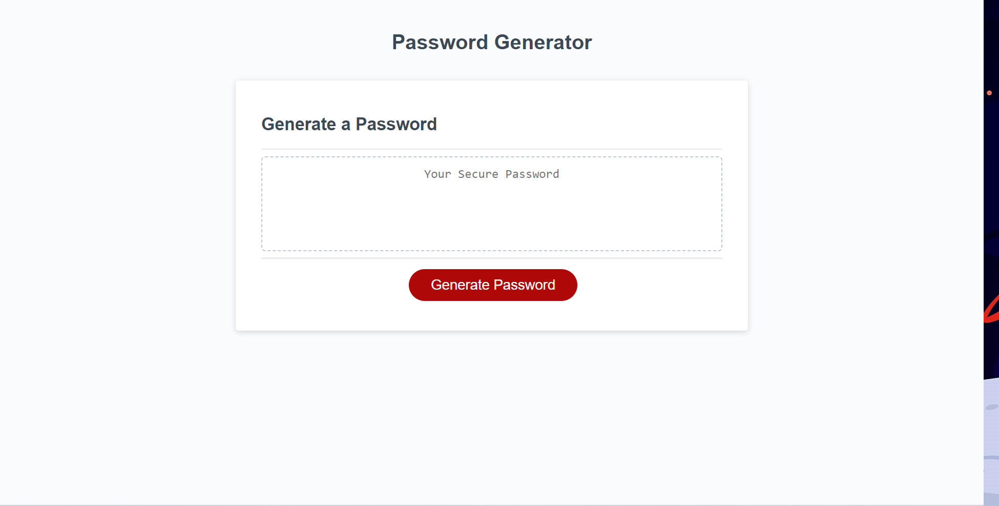

# Challenge3-Password-Generator
## Description

This assigment required me to modify starter code to create an application that enables employees to generate random passwords based on criteria that they’ve selected. The app will be running in the browser and will feature dynamically updated HTML and CSS powered by JavaScript code.

## Installation

N/A

## Usage

 <a href = "https://anicabarrios.github.io/Challenge3-Password-Generator/">Live link</a>

 

## Credits

N/A

## License

Please refer to the LICENSE in the repo.
